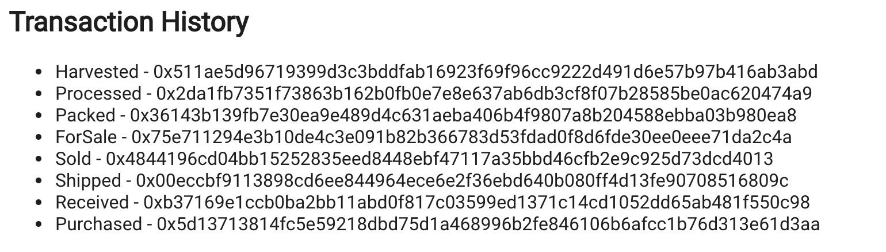

# Supply Chain


## Project Write Up (UML)
**Activity Diagram**    


**Sequence Diagram**    


**State Diagram**    


**Data Model Diagram**    


## Project Write Up (Libraries)
Used openzeppelin-solidity Roles library for access controls for the different actors in the supply chain.  
Used @truffle/hdwallet-provider as a convenient and easy to configure network connection to ethereum through infura.io (or any other compatible provider).
For example the HDWallet provider add some features required by Truffle that are not available with infura like event filtering and transaction signing.
Created a project at infura.io to house the contract on Rinkeby

## Project Write Up (IPFS)
Did not have enough time to implement Interplanetary File System to store images

## Project Write Up (General Write Up)

After deployement to Rinkeby you must modify the /build/SupplyChain.json to include the contract address and Transaction Hash so that the node webpage will interact with contract on rinkeby.    

Rinkeby Contract Address: https://rinkeby.etherscan.io/address/0xd9eb67569a5078109b674a84b9b0d5e756f5b474    

Node v14.19.0  
Truffle v4.1.14 (core: 4.1.14)  
Solidity v0.4.24 (solc-js)  

## MIGRATION OUTPUT
truffle migrate --network rinkeby --reset
Compiling ./contracts/Migrations.sol...
Compiling ./contracts/coffeeaccesscontrol/ConsumerRole.sol...
Compiling ./contracts/coffeeaccesscontrol/DistributorRole.sol...
Compiling ./contracts/coffeeaccesscontrol/FarmerRole.sol...
Compiling ./contracts/coffeeaccesscontrol/RetailerRole.sol...
Compiling ./contracts/coffeeaccesscontrol/Roles.sol...
Compiling ./contracts/coffeebase/SupplyChain.sol...
Compiling ./contracts/coffeecore/Ownable.sol...
Writing artifacts to ./build/contracts

Using network 'rinkeby'.

Running migration: 1_initial_migration.js
  Deploying Migrations...
  ... 0x1648b9556454168009415fac3cd0c91df2db218de3b2b09e5d395f708520f608
  Migrations: 0x69f314c075b4bb87037fab27fd6ae257bf7d7fd4
Saving successful migration to network...
  ... 0xf7aec85fbbdec49e45dd4692ed908f2a14c8e6e7299ffc1727387e2cd3d6cf4b
Saving artifacts...
Running migration: 2_deploy_contracts.js
  Deploying FarmerRole...
  ... 0xc9f9ca29824f2972ad4c0da25c44251c8ae01c83a4057ede7e29772c477ab604
  FarmerRole: 0x9cf41636f4efc1f0bd45eb1017b93e7b6575d4e9
  Deploying DistributorRole...
  ... 0x798c57a70f32bf6153def3b4d51990713a0fbfd9031d747a08e641a546b4608a
  DistributorRole: 0x1a8e5b2e36fc461dec30ae9a52879134c4842f77
  Deploying RetailerRole...
  ... 0x16caa4d3e7fe8894cbf433e781e41a3d3954d7bcbf584891adff12b8ae3d6b45
  RetailerRole: 0xaa5f063aefc93388b26bf23017641a78ff9c7e11
  Deploying ConsumerRole...
  ... 0x904b786c8294f6f9673f92a24782a8893675d671bc5ce18752ca36a178dab940
  ConsumerRole: 0xd94dfd2b21c7643673094f862c3bc1ff80d0d275
  Deploying SupplyChain...
  ... 0x182cf6a91d4a932a0eae064cada25de0eff986db905353cbd4ec7693932989d8
  SupplyChain: 0xd9eb67569a5078109b674a84b9b0d5e756f5b474
Saving successful migration to network...
  ... 0xa52edb5c94dbfc6196fb02ededb033a6dd3b3a85ad9749e49ef67abe9ad9a3c7
Saving artifacts...

## DEFAULT INFO FROM UDACITY CLONE
This repository containts an Ethereum DApp that demonstrates a Supply Chain flow between a Seller and Buyer. The user story is similar to any commonly used supply chain process. A Seller can add items to the inventory system stored in the blockchain. A Buyer can purchase such items from the inventory system. Additionally a Seller can mark an item as Shipped, and similarly a Buyer can mark an item as Received.

The DApp User Interface when running should look like...





## Getting Started

These instructions will get you a copy of the project up and running on your local machine for development and testing purposes. See deployment for notes on how to deploy the project on a live system.

### Prerequisites

Please make sure you've already installed ganache-cli, Truffle and enabled MetaMask extension in your browser.

```
Give examples (to be clarified)
```

### Installing

> The starter code is written for **Solidity v0.4.24**. At the time of writing, the current Truffle v5 comes with Solidity v0.5 that requires function *mutability* and *visibility* to be specified (please refer to Solidity [documentation](https://docs.soliditylang.org/en/v0.5.0/050-breaking-changes.html) for more details). To use this starter code, please run `npm i -g truffle@4.1.14` to install Truffle v4 with Solidity v0.4.24. 

A step by step series of examples that tell you have to get a development env running

Clone this repository:

```
git clone https://github.com/udacity/nd1309/tree/master/course-5/project-6
```

Change directory to ```project-6``` folder and install all requisite npm packages (as listed in ```package.json```):

```
cd project-6
npm install
```

Launch Ganache:

```
ganache-cli -m "spirit supply whale amount human item harsh scare congress discover talent hamster"
```

Your terminal should look something like this:


In a separate terminal window, Compile smart contracts:

```
truffle compile
```

Your terminal should look something like this:


This will create the smart contract artifacts in folder ```build\contracts```.

Migrate smart contracts to the locally running blockchain, ganache-cli:

```
truffle migrate
```

Your terminal should look something like this:


Test smart contracts:

```
truffle test
```

All 10 tests should pass.


In a separate terminal window, launch the DApp:

```
npm run dev
```

## Built With

* [Ethereum](https://www.ethereum.org/) - Ethereum is a decentralized platform that runs smart contracts
* [IPFS](https://ipfs.io/) - IPFS is the Distributed Web | A peer-to-peer hypermedia protocol
to make the web faster, safer, and more open.
* [Truffle Framework](http://truffleframework.com/) - Truffle is the most popular development framework for Ethereum with a mission to make your life a whole lot easier.


## Authors


## Acknowledgments

* Solidity
* Ganache-cli
* Truffle
* IPFS
